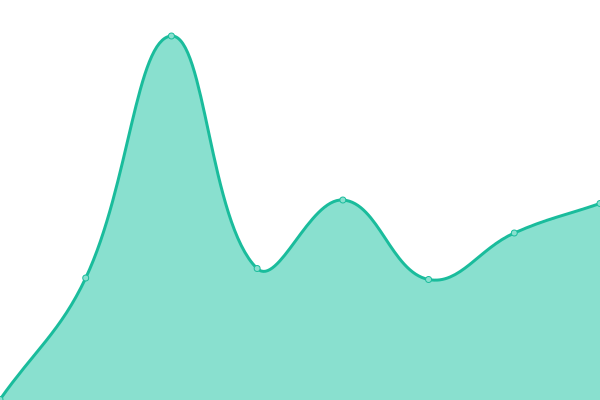

# [📈 Live Status](https://cioos-siooc.github.io/cwatch-upptime): <!--live status--> **🟧 Partial outage**

This repository contains the open-source uptime monitor and status page for [CIOOS-SIOOC](https://cioos-siooc.github.io/cwatch-upptime), powered by [Upptime](https://github.com/upptime/upptime).

With [Upptime](https://upptime.js.org), you can get your own unlimited and free uptime monitor and status page, powered entirely by a GitHub repository. We use [Issues](https://github.com/cioos-siooc/cwatch-upptime/issues) as incident reports, [Actions](https://github.com/cioos-siooc/cwatch-upptime/actions) as uptime monitors, and [Pages](https://cioos-siooc.github.io/cwatch-upptime) for the status page.

<!--start: status pages-->
<!-- This summary is generated by Upptime (https://github.com/upptime/upptime) -->
<!-- Do not edit this manually, your changes will be overwritten -->
<!-- prettier-ignore -->
| URL | Status | History | Response Time | Uptime |
| --- | ------ | ------- | ------------- | ------ |
|  [Cioos National Wordpress](https://cioos.ca/) | 🟩 Up | [cioos-national-wordpress.yml](https://github.com/cioos-siooc/cwatch-upptime/commits/HEAD/history/cioos-national-wordpress.yml) | 

 1575ms
     
 | 

<a href="https://cioos-siooc.github.io/cwatch-upptime/history/cioos-national-wordpress">100.00%</a>
    

|  [Cioos National CKAN](https://catalogue.cioos.ca/) | 🟩 Up | [cioos-national-ckan.yml](https://github.com/cioos-siooc/cwatch-upptime/commits/HEAD/history/cioos-national-ckan.yml) | 

 1942ms
     
 | 

<a href="https://cioos-siooc.github.io/cwatch-upptime/history/cioos-national-ckan">99.61%</a>
    

|  [Cioos National CKAN Sitemap](https://catalogue.cioos.ca/sitemap/sitemap-1.xml) | 🟩 Up | [cioos-national-ckan-sitemap.yml](https://github.com/cioos-siooc/cwatch-upptime/commits/HEAD/history/cioos-national-ckan-sitemap.yml) | 

 321ms
     
 | 

<a href="https://cioos-siooc.github.io/cwatch-upptime/history/cioos-national-ckan-sitemap">99.64%</a>
    

|  [Cioos Atlantic Wordpress](https://cioosatlantic.ca/) | 🟩 Up | [cioos-atlantic-wordpress.yml](https://github.com/cioos-siooc/cwatch-upptime/commits/HEAD/history/cioos-atlantic-wordpress.yml) | 

 331ms
     
 | 

<a href="https://cioos-siooc.github.io/cwatch-upptime/history/cioos-atlantic-wordpress">100.00%</a>
    

|  [Cioos Atlantic CKAN](https://catalogue.cioosatlantic.ca/) | 🟩 Up | [cioos-atlantic-ckan.yml](https://github.com/cioos-siooc/cwatch-upptime/commits/HEAD/history/cioos-atlantic-ckan.yml) | 

 486ms
     
 | 

<a href="https://cioos-siooc.github.io/cwatch-upptime/history/cioos-atlantic-ckan">100.00%</a>
    

|  [VITALITY CKAN](https://catalogue.registry.cioosatlantic.ca/) | 🟩 Up | [vitality-ckan.yml](https://github.com/cioos-siooc/cwatch-upptime/commits/HEAD/history/vitality-ckan.yml) | 

 664ms
     
 | 

<a href="https://cioos-siooc.github.io/cwatch-upptime/history/vitality-ckan">100.00%</a>
    

|  [Cioos Atlantic CKAN Sitemap](https://catalogue.cioosatlantic.ca/sitemap/sitemap-1.xml) | 🟩 Up | [cioos-atlantic-ckan-sitemap.yml](https://github.com/cioos-siooc/cwatch-upptime/commits/HEAD/history/cioos-atlantic-ckan-sitemap.yml) | 

 101ms
     
 | 

<a href="https://cioos-siooc.github.io/cwatch-upptime/history/cioos-atlantic-ckan-sitemap">100.00%</a>
    

|  [Cioos Atlantic ERDDAP](https://cioosatlantic.ca/erddap/index.html) | 🟩 Up | [cioos-atlantic-erddap.yml](https://github.com/cioos-siooc/cwatch-upptime/commits/HEAD/history/cioos-atlantic-erddap.yml) | 

 94ms
     
 | 

<a href="https://cioos-siooc.github.io/cwatch-upptime/history/cioos-atlantic-erddap">100.00%</a>
    

|  [St. Lawrence Global Observatory Wordpress](https://ogsl.ca/en/home-slgo/) | 🟩 Up | [st-lawrence-global-observatory-wordpress.yml](https://github.com/cioos-siooc/cwatch-upptime/commits/HEAD/history/st-lawrence-global-observatory-wordpress.yml) | 

 296ms
     
 | 

<a href="https://cioos-siooc.github.io/cwatch-upptime/history/st-lawrence-global-observatory-wordpress">100.00%</a>
    

|  [St. Lawrence Global Observatory CKAN](https://catalogue.ogsl.ca/en/) | 🟩 Up | [st-lawrence-global-observatory-ckan.yml](https://github.com/cioos-siooc/cwatch-upptime/commits/HEAD/history/st-lawrence-global-observatory-ckan.yml) | 

 593ms
     
 | 

<a href="https://cioos-siooc.github.io/cwatch-upptime/history/st-lawrence-global-observatory-ckan">100.00%</a>
    

|  [St. Lawrence Global Observatory CKAN Sitemap](https://catalogue.ogsl.ca/sitemap/sitemap-1.xml) | 🟩 Up | [st-lawrence-global-observatory-ckan-sitemap.yml](https://github.com/cioos-siooc/cwatch-upptime/commits/HEAD/history/st-lawrence-global-observatory-ckan-sitemap.yml) | 

 89ms
     
 | 

<a href="https://cioos-siooc.github.io/cwatch-upptime/history/st-lawrence-global-observatory-ckan-sitemap">100.00%</a>
    

|  [St. Lawrence Global Observatory ERDDAP](https://erddap.ogsl.ca/erddap/index.html) | 🟩 Up | [st-lawrence-global-observatory-erddap.yml](https://github.com/cioos-siooc/cwatch-upptime/commits/HEAD/history/st-lawrence-global-observatory-erddap.yml) | 

 215ms
     
 | 

<a href="https://cioos-siooc.github.io/cwatch-upptime/history/st-lawrence-global-observatory-erddap">99.81%</a>
    

|  [Cioos Pacific Wordpress](https://cioospacific.ca) | 🟩 Up | [cioos-pacific-wordpress.yml](https://github.com/cioos-siooc/cwatch-upptime/commits/HEAD/history/cioos-pacific-wordpress.yml) | 

 260ms
     
 | 

<a href="https://cioos-siooc.github.io/cwatch-upptime/history/cioos-pacific-wordpress">100.00%</a>
    

|  [CIOOS Pacific Wordpress Login Page](https://cioospacific.ca/wp-admin/) | 🟩 Up | [cioos-pacific-wordpress-login-page.yml](https://github.com/cioos-siooc/cwatch-upptime/commits/HEAD/history/cioos-pacific-wordpress-login-page.yml) | 

 654ms
     
 | 

<a href="https://cioos-siooc.github.io/cwatch-upptime/history/cioos-pacific-wordpress-login-page">99.14%</a>
    

|  [Cioos Pacific Applied Data - Marine Heat Waves](https://cioospacific.ca/applied-data/marine-heat-monitor/) | 🟩 Up | [cioos-pacific-applied-data-marine-heat-waves.yml](https://github.com/cioos-siooc/cwatch-upptime/commits/HEAD/history/cioos-pacific-applied-data-marine-heat-waves.yml) | 

 42ms
     
 | 

<a href="https://cioos-siooc.github.io/cwatch-upptime/history/cioos-pacific-applied-data-marine-heat-waves">100.00%</a>
    

|  [Cioos Pacific Applied Data - Marine Heat Waves iframe Source](https://hakaiinstitute.github.io/ssta_images/dist) | 🟩 Up | [cioos-pacific-applied-data-marine-heat-waves-iframe-source.yml](https://github.com/cioos-siooc/cwatch-upptime/commits/HEAD/history/cioos-pacific-applied-data-marine-heat-waves-iframe-source.yml) | 

 207ms
     
 | 

<a href="https://cioos-siooc.github.io/cwatch-upptime/history/cioos-pacific-applied-data-marine-heat-waves-iframe-source">100.00%</a>
    

|  [Cioos Pacific CKAN](https://catalogue.cioospacific.ca) | 🟩 Up | [cioos-pacific-ckan.yml](https://github.com/cioos-siooc/cwatch-upptime/commits/HEAD/history/cioos-pacific-ckan.yml) | 

 431ms
     
 | 

<a href="https://cioos-siooc.github.io/cwatch-upptime/history/cioos-pacific-ckan">100.00%</a>
    

|  [Cioos Pacific CKAN Sitemap](https://catalogue.cioospacific.ca/sitemap/sitemap-1.xml) | 🟥 Down | [cioos-pacific-ckan-sitemap.yml](https://github.com/cioos-siooc/cwatch-upptime/commits/HEAD/history/cioos-pacific-ckan-sitemap.yml) | 

 84ms
     
 | 

<a href="https://cioos-siooc.github.io/cwatch-upptime/history/cioos-pacific-ckan-sitemap">0.00%</a>
    

|  [Cioos Pacific ERDDAP](https://data.cioospacific.ca/erddap/index.html) | 🟩 Up | [cioos-pacific-erddap.yml](https://github.com/cioos-siooc/cwatch-upptime/commits/HEAD/history/cioos-pacific-erddap.yml) | 

 327ms
     
 | 

<a href="https://cioos-siooc.github.io/cwatch-upptime/history/cioos-pacific-erddap">100.00%</a>
    

|  [SmartAtlantic ERDDAP](https://www.smartatlantic.ca/erddap/index.html) | 🟩 Up | [smart-atlantic-erddap.yml](https://github.com/cioos-siooc/cwatch-upptime/commits/HEAD/history/smart-atlantic-erddap.yml) | 

 672ms
     
 | 

<a href="https://cioos-siooc.github.io/cwatch-upptime/history/smart-atlantic-erddap">100.00%</a>
    

|  [CIOOS Pacific Dev CKAN](https://catalogue.pac-dev1.cioos.org/) | 🟩 Up | [cioos-pacific-dev-ckan.yml](https://github.com/cioos-siooc/cwatch-upptime/commits/HEAD/history/cioos-pacific-dev-ckan.yml) | 

 487ms
     
 | 

<a href="https://cioos-siooc.github.io/cwatch-upptime/history/cioos-pacific-dev-ckan">100.00%</a>
    

|  [CIOOS Data Explorer Website](https://explore.cioos.ca) | 🟩 Up | [cioos-data-explorer-website.yml](https://github.com/cioos-siooc/cwatch-upptime/commits/HEAD/history/cioos-data-explorer-website.yml) | 

 241ms
     
 | 

<a href="https://cioos-siooc.github.io/cwatch-upptime/history/cioos-data-explorer-website">100.00%</a>
    

|  [CIOOS Data Explorer API](https://explore.cioos.ca/api/) | 🟩 Up | [cioos-data-explorer-api.yml](https://github.com/cioos-siooc/cwatch-upptime/commits/HEAD/history/cioos-data-explorer-api.yml) | 

 56ms
     
 | 

<a href="https://cioos-siooc.github.io/cwatch-upptime/history/cioos-data-explorer-api">100.00%</a>
    

|  [CIOOS Pacific ERDDAP dataset DFO_MEDS_BUOYS](https://data.cioospacific.ca/erddap/tabledap/DFO_MEDS_BUOYS.htmlTable?STN_ID&time>=now-1week&distinct()) | 🟩 Up | [cioos-pacific-erddap-dataset-dfo-meds-buoys.yml](https://github.com/cioos-siooc/cwatch-upptime/commits/HEAD/history/cioos-pacific-erddap-dataset-dfo-meds-buoys.yml) | 

 1763ms
     
 | 

<a href="https://cioos-siooc.github.io/cwatch-upptime/history/cioos-pacific-erddap-dataset-dfo-meds-buoys">100.00%</a>
    

|  [CIOOS Pacific ERDDAP dataset ECCC_MSC_BUOYS](https://data.cioospacific.ca/erddap/tabledap/ECCC_MSC_BUOYS.htmlTable?wmo_synop_id&time>now-3hours&distinct()) | 🟩 Up | [cioos-pacific-erddap-dataset-eccc-msc-buoys.yml](https://github.com/cioos-siooc/cwatch-upptime/commits/HEAD/history/cioos-pacific-erddap-dataset-eccc-msc-buoys.yml) | 

 367ms
     
 | 

<a href="https://cioos-siooc.github.io/cwatch-upptime/history/cioos-pacific-erddap-dataset-eccc-msc-buoys">100.00%</a>
    

|  [CIOOS Metadata Entry Form Region Page](https://cioos-siooc.github.io/metadata-entry-form/#/en/region-select) | 🟥 Down | [cioos-metadata-entry-form-region-page.yml](https://github.com/cioos-siooc/cwatch-upptime/commits/HEAD/history/cioos-metadata-entry-form-region-page.yml) | 

 99ms
     
 | 

<a href="https://cioos-siooc.github.io/cwatch-upptime/history/cioos-metadata-entry-form-region-page">0.00%</a>
    

<!--end: status pages-->

[**Visit our status website →**](https://cioos-siooc.github.io/cwatch-upptime)

## 📄 License

- Powered by: [Upptime](https://github.com/upptime/upptime)
- Code: [MIT](./LICENSE) © [CIOOS-SIOOC](https://cioos-siooc.github.io/cwatch-upptime)
- Data in the `./history` directory: [Open Database License](https://opendatacommons.org/licenses/odbl/1-0/)
